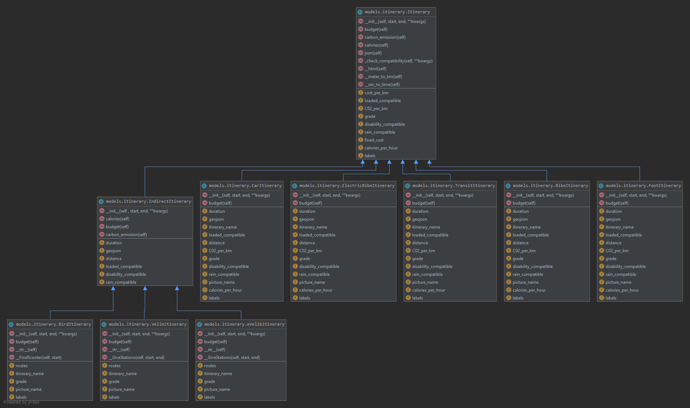

# Maps 2.0

A partir des coordonnées GPS d’une personne et de l’adresse à laquelle elle veut se rendre et de certains critères, indiquer à l’utilisateur s’il vaut mieux prendre un Vélib’, une autolib’ ou le métro.
On se limitera à la ville de Paris et on se concentrera sur des critères tels que : la météo, les stations de métro/vélib/autolib à proximité du lieu de départ et d’arrivée, la charge à porter, etc…
Une interface graphique n’est pas obligatoire pour ce projet.

## 1. Présentation et fonctionnalités
Nous avons choisi de passer par une interface Web pour présenter les résultats de notre projet. Celle-ci permet de présenter des résultats pour des trajets entre deux points trouvés grâce aux deux barres de recherche.

Les résultats obtenus peuvent être filtrés en fonction des préférences de l'utilisateur (préfère un trajet couvert ...) et aussi triés selon la distance, la durée ou d'autres critères. Le tri de s'effectue par défault avec notre recommandation qui trie les itinéraires selon un note calculé en pondérant différents critères.
## 2. POOA

Voici l'architecture de nos classes pour ce projet. On a choisi de créer des classes pour chaque type d'itinéraire, qui héritent tous de la classe mère **Itinerary** et, pour celles qui sont composées de plusieurs itinéraires distincts, aussi de la classe **Indirect Itinerary**



## 3. Utilisation

### Installation

Les librairies nécéssaires sont indiquées dans le fichier ```requirements.txt```
Pour les installer, il suffit de se placer dans le dossier maps_2.0, et d'éxécuter la commande suivante:

#### Pour Linux
```
pip install -r requirements.txt
```
*Solution alternative :* utiliser l'environnement virtuel présent dans l'archive zip via la commande 
```
source venv/bin/activate
```

#### Windows
```
python -m pip install -r requirements.txt 
```

### Lancement du serveur
Dans le dossier du projet, executer le fichier 
```__main__.py```
via la commande :
```python __main__.py```

**Remarque :** le paramètre ```--debugger``` ou ```-d``` à l'exécution permet de lancer le programme en mode débugger, avec des logs plus détaillés

Le serveur Flask démarre alors, et les logs sont visibles en console.
L'application est accessible depuis un navigateur web via l'url donnée en console (par défault: http://127.0.0.1:5000/).


