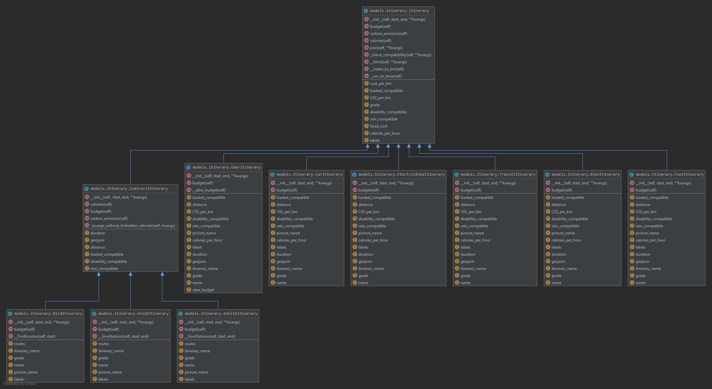

# Maps 2.0

A partir des coordonnées GPS d’une personne et de l’adresse à laquelle elle veut se rendre et de certains critères, indiquer à l’utilisateur s’il vaut mieux prendre un Vélib’, une autolib’ ou le métro.
On se limitera à la ville de Paris et on se concentrera sur des critères tels que : la météo, les stations de métro/vélib/autolib à proximité du lieu de départ et d’arrivée, la charge à porter, etc…
Une interface graphique n’est pas obligatoire pour ce projet.

## 1. Présentation et fonctionnalités
Nous avons choisi de passer par une interface Web pour présenter les résultats de notre projet. Celle-ci permet de présenter des résultats pour des trajets entre deux points trouvés grâce aux deux barres de recherche.

### 1.1 Experience utilisateur


Les résultats obtenus peuvent être filtrés en fonction des préférences de l'utilisateur:
 * Ses préférences: Trajet couvert, (préfère un trajet couvert ...) et aussi triés selon la durée, le prix ou d'autres critères. 
 * Si celui-ci possède bien le véhicule associé.
 * Si celui-ci préfère une classement selon un critère spécifique autre que notre note globale.
 
Le tri s'effectue donc par défault avec notre note globale. Les itinéraires sont affichés en ordre décroissant selon cette note calculée en pondérant les différents critères qui nous paraissaient les plus pertinents.

L'utilisateur a également accès à des informations supplémentaires telles que le meilleur itinéraire pour un critère donné grâce à de petites vignettes associées et au risque de pluie.


### 1.2 Services utilisés et modèles sous-jacents

**Liste des Services et APIs utilisés:**
* ***OpenRouteService***:
    * **Utilisation**: Permet de d'accéder aux données de durée, de distance et de direction pour des itinéraires simples (à pied, à vélo, en voiture, etc...)
    * **Lien**: https://openrouteservice.org/category/api/
    * **Limites**: Le nombre limites d'appels par jour est de 2000 ou de 40 par minute. Cela n'est pas limitant pour un seul utilisateur. OpenRouteService ne prend pas en compte le trafic routier dans le calcul de durée, cela peut-être une source majeure d'erreur aux heures de pointe.
    
* ***Gmaps***:
    * **Utilisation**: Permet de d'accéder aux données de durée, de distance et de direction pour les itinéraires en transport en commun qui sont les plus complexes.
    * **Lien**: https://cloud.google.com/maps-platform/routes/
    * **Limites**: Le nombre limites d'appels est de 40000 par mois (au-delà de cette limite nous sommes facturés). Cela n'est pas limitant pour un seul utilisateur. Gmaps représente notre unique source pour la partie liée aux transports en commun, en cas de perte de ce fournisseur nous ne pourrions difficilement continuer Maps_2.0.
    
* ***Velib***:
    * **Utilisation**: Permet de d'accéder aux stations Velib les plus proches du départ et de l'arrivée spécifiées par l'utilisateur. Ces informations sont ensuite utilisées pour construire les sous-itinéraires par moyen de transport.
    * **Lien**: https://opendata.paris.fr/explore/dataset/velib-disponibilite-en-temps-reel/information/
    * **Limites**: Pas de clé, pas de limites d'appels grâce à l'initiative opendata.paris.
    
* ***Bird***:
    * **Utilisation**: Permet de d'accéder à la trotinette Bird la plus proche du départ spécifié par l'utilisateur. Ces informations sont ensuite utilisées pour construire les sous-itinéraires par moyen de transport.
    * **Lien**: https://github.com/ubahnverleih/WoBike/blob/master/Bird.md
    * **Limites**: API non-officielle qui utilise le service Bird comme si nous étions un vrai utilisateur. La clé utilisateur peut périmer relativement vite, il faut alors de nouveau passer par le processus de création spécifié sur la page.
    
* ***Accuweather***:
    * **Utilisation**: Permet de connaître les conditions météorologiques dans l'heure qui suit la requête de manière à afficher cette information à l'utilisateur pour les moyens de transports à risque.
    * **Lien**: https://developer.accuweather.com/accuweather-forecast-api/apis/get/forecasts/v1/hourly/1hour/%7BlocationKey%7D
    * **Limites**: Le nombre limites d'appels par jour est de 50. Cela peut vite devenir limitant, même pour un seul utilisateur.

* ***Algolia***:
    * **Utilisation**: Permet la suggestion automatique d'adresses à partir des mots clés soumis par l'utilisateur. Permet aussi la génération des coordonnées GPS.
    * **Lien**: https://community.algolia.com/places/documentation.html
    * **Limites**: Le nombre limites d'appels par mois est de 100000 (avec 1 appel par lettre tapée dans la barre de recherche). Cela n'est pas limitant pour un seul utilisateur.

* ***OpenStreetMap***:
    * **Utilisation**: Permet l'accès au fond de carte servant de base pour notre affichage interactif de l'itinéraire.
    * **Lien**: https://www.openstreetmap.fr/
    * **Limites**: Pas de clé, pas de limites d'appels dans le cadre d'une utlisation marginale.
    
Le choix de ses différentes APIs s'est d'abord fait sur leur libre accès. Dans le cas de OpenRouteService et Maps, nous avons fait le choix de dépendre le moins possible de l'API gérée par Google dans la mesure du possible.

**Notes spécifique sur les APIs**

Toutes les APIs utilisées sont publiques. Certaines ont un nombre très limité d'appels par jour. Il est donc fort possible qu'une API soit momentanément indisponible, auquel cas certains trajets pourraient ne pas s'afficher sur l'interface Web. 
La source de l'erreur est alors accessible via la console.


## 2. POOA

L'architecture de notre projet se construit autour de la notion d'itinéraire. 
Schématiquement, un itinéraire est défini par un départ, une arrivée et un moyen de transport ainsi que des attributs calculés à partir de ces informations (distances, durée, CO2).
Un itinéraire complexe (transport en commun, Velib, etc...) peut alors se décomposer en une suite d'itinéraires simples.

***Héritage***

A chaque type d'itinéraire et moyen de transport est associé une classe. Celles-ci qui héritent toutes de la classe mère **Itinerary** . Celles qui se composent de plusieurs itinéraires distincts, héritent également de la classe **Indirect Itinerary**.
L'héritage peut être réprésenté par le diagramme suivant:


***Factory:***

Une factory est utilisée de manière à créer nos différents itinéraires plus simplement. Celle-ci peut être retrouvée dans le fichier itinerary_factory.py

***Multi-thread:***

De manière à réduire au maximum le temps de réponse pour l'utilisateur, chaque itinéraire se créée sur un thread différent. Les threads sont instanciés par la factory, chaque réponse préliminaire d'un thread est ajouté dans une queue. Lorsque le dernier calcul d'itinéraire s'achève, les résultats stockés dans la queue sont transférés vers l'objet routes.


## 3. Utilisation

### Installation

Les librairies nécéssaires sont indiquées dans le fichier ```requirements.txt```
Pour les installer, il suffit de **se placer dans le dossier maps_2.0**, et d'éxécuter la commande suivante:

#### Pour Linux
```
pip install -r requirements.txt
```
*Solution alternative :* utiliser l'environnement virtuel présent dans l'archive zip via la commande 
```
source venv/bin/activate
```

#### Pour Windows
```
python -m pip install -r requirements.txt 
```

### Lancement du serveur
Dans le dossier du projet, executer le fichier 
```__main__.py```
via la commande :
```python __main__.py```

**Remarque :** le paramètre ```--debugger``` ou ```-d``` à l'exécution permet de lancer le programme en mode débugger, avec des logs plus détaillés

Le serveur Flask démarre alors, et les logs sont visibles en console.
L'application est accessible depuis un navigateur web via l'url donnée en console (par défault: http://127.0.0.1:5000/).


